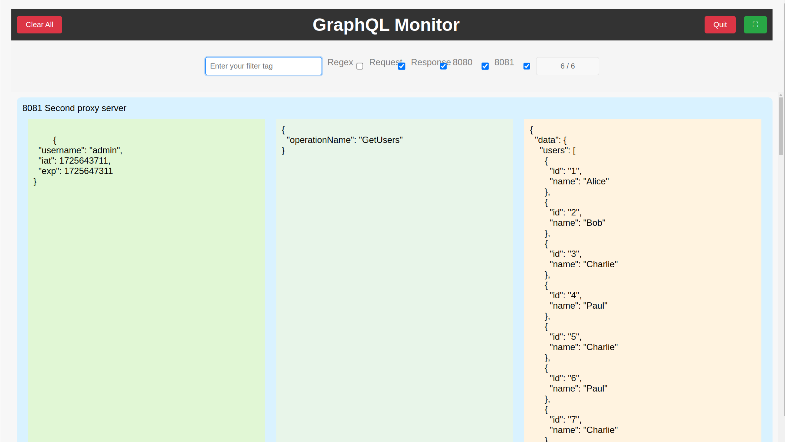

# Usage

To use this tool, follow the steps below:

1. Install the required dependencies by running `npm install` or `npm ci`.
2. Run tests by executing `npm run test`.
3. Start the application by running `npm run start`.

## Detailed Usage


1. **Filter Tag Input**: 
   - A field for users to input keywords or regular expressions to filter GraphQL requests and responses.
   - Users can use this to find specific requests, such as those matching a certain operation name like "GetUsers."

2. **Request/Response Toggles**:
   - Checkboxes allow users to selectively display only requests, only responses, or both. By default, both are checked.
   - Example:
     - **Request Toggle**: Shows only GraphQL requests.
     - **Response Toggle**: Shows only GraphQL responses.

3. **Port Filters (8080, 8081)**:
   - Users can filter requests based on which server port the request was sent to.
   - In this case, both **8080** and **8081** can be selected or deselected to display traffic from specific ports.

4. **Data Counter**:
   - The top-right corner shows a counter that tracks the total number of requests. The format is `X/Y`, where:
     - **X** is the number of currently displayed requests.
     - **Y** is the total number of requests captured.

5. **GraphQL Rows**:
   - The main display area shows detailed GraphQL request and response data in three columns:
     - **JWT Token Container**: Displays JSON Web Token (JWT) information (e.g., username, issued at, expiry).
     - **Request Box**: Displays GraphQL operation details (e.g., the operation name such as "GetUsers").
     - **Response Box**: Displays the response data, including user information (e.g., user IDs and names like "Alice", "Bob", "Charlie", etc.).

6. **Clear All Button**:
   - A button in the top-left corner allows users to clear all applied filters and reset the display, effectively showing no data.

7. **Quit Button**:
   - The button on the right terminates the application.

## Example Use Cases

1. **Filter by Operation Name**:
   - To view all requests for the `GetUsers` operation, simply type `GetUsers` in the filter tag field. The app will then display matching requests and responses.

2. **Port-Specific Filtering**:
   - If you are only interested in requests sent to port 8080, uncheck the box for port 8081. This will filter the view to show requests handled by the 8080 server.

3. **View Only Responses**:
   - By unchecking the **Request** checkbox, users can hide requests and only see the responses. Similarly, the reverse can be done to only view requests.

4. **Clear All**:
   - The **Clear All** button can be used to remove all applied filters and reset the view to show no data, especially useful when starting a new monitoring session.


# Blocking Specific URLs or Ports

You can configure the app to block certain URLs or ports, preventing data from those sources from being displayed. This feature is especially useful for excluding irrelevant or sensitive traffic from being shown in the monitor.

## Steps to Block URLs/Ports:

1. **Create a Configuration File**:
   - Define which URLs or ports you want to block in a configuration file. Example configuration for blocking local requests:

```
{
  "blockedURLs": [
    "127.0.0.1"
  ]
}
```

   Alternatively, to block only port 8080, your config might look like this:

```
{
  "blockedPorts": [
    "8080"
  ]
}
```

2. **Start the App with the Configuration**:
   - Pass the configuration file as an argument when launching the app:

```
electron . --no-sandbox --configPath=path/to/config.json
```

## Example Configurations and Results:

- **Block All Localhost (127.0.0.1)**:
   - With a configuration that blocks `127.0.0.1`, all requests originating from this address will be blocked and no data will be displayed.

```
{
  "blockedURLs": ["127.0.0.1"]
}
```

   After applying the filter, no rows will be shown in the app even if there were matching requests.

- **Block Only Port 8080**:
   - If you want to block requests from port 8080 but allow others (like 8081), you can configure the app like this:

```
{
  "blockedPorts": ["8080"]
}
```

   After applying a filter, only requests from port 8081 will be displayed. In the case of blocking port 8080, you will see only two rows.
